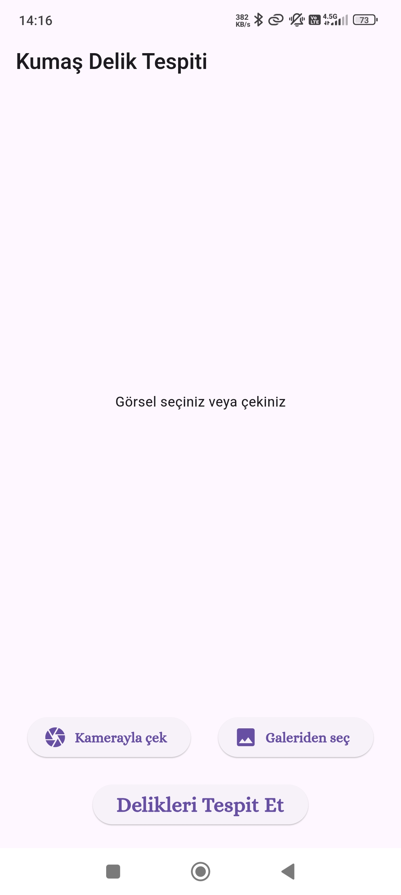
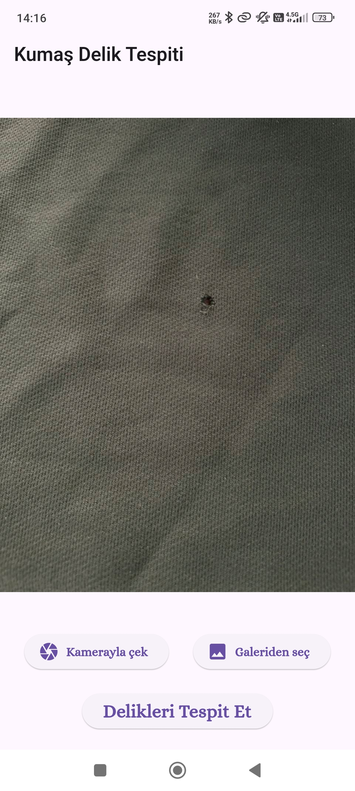
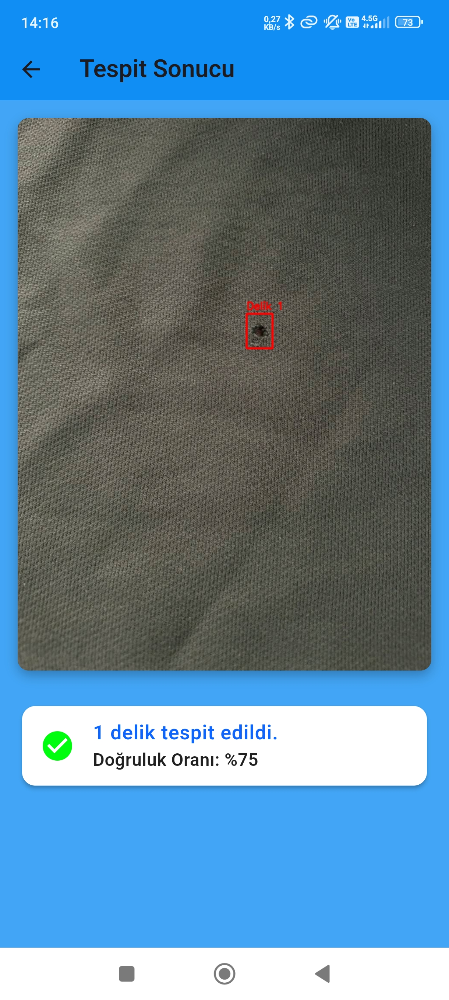
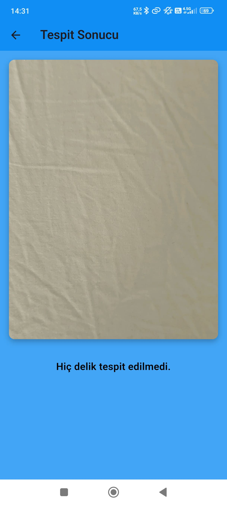

# Fabric Defect Detection

Finds holes in fabric from a photo. A YOLOv8 model runs as TensorFlow Lite behind a FastAPI service, and a Flutter app sends pictures to it.


| Main screen | Image selected | Result | Nothing found |
| :---: | :---: | :---: | :---: |
|  |  |  |  |

## Results

The dataset was assembled from Kaggle and Roboflow sources and labelled by hand, then augmented with flips, rotations and contrast shifts. One class: `Holes`.

| Metric | Value |
| :--- | ---: |
| mAP | 95.1% |
| Precision | 97.9% |
| Recall | 86.8% |

Training used batch size 16 at 640×640, AdamW, learning rate 0.001 decaying to 0.0001, weight decay 0.0005, and early stopping after 20 epochs without improvement.

Recall is the number worth improving. At 86.8% the model misses some real holes, while precision at 97.9% means it almost never flags clean fabric.

## How it works

```
Flutter app  ──POST /detect──►  FastAPI  ──►  YOLOv8 (TFLite)
    ▲                                             │
    └───────  JSON: boxes, scores, image  ◄───────┘
```

The app compresses the selected image and posts it as multipart form data. The backend replies with the annotated image as base64, plus a box and confidence score for each detection.

The pipeline lives in `backend/app/utils/`.

**Preprocessing.** Resize to 640×640, convert to YUV and equalise the histogram of the luma channel, convert back to RGB, normalise to `[0,1]`, transpose to CHW, add a batch dimension as `float32`. The histogram equalisation is there because phone photos of cloth come with uneven lighting.

**Inference.** `tf.lite.Interpreter` loads the model once at import time, so only the first request pays for tensor allocation.

**Postprocessing.** Drop predictions below 0.50 confidence, convert `xywh` boxes to `xyxy`, rescale them from 640×640 back to the original image size, then run OpenCV `NMSBoxes` at IoU 0.5 to remove overlaps.

The model was trained in PyTorch, exported to ONNX for portability, then converted to TFLite. The `.tflite` file ships in `backend/app/model/` and is 43 MB.

## Layout

```
backend/                  FastAPI service
  app/main.py             GET / status page, POST /detect
  app/services/           detection orchestration, box drawing
  app/utils/              preprocessing, inference, postprocessing
  app/model/              model.tflite, class_names.txt
  tests/                  endpoint and inference tests
mobile/                   Flutter app (fabric_inspector)
  lib/screens/            home and detection screens
  lib/services/           API client
  lib/models/             response parsing
docs/
  screenshots/            app screenshots
  project-report-tr.pdf   full project report, Turkish, 16 pages
```

## Running it

Backend:

```bash
cd backend
python -m venv .venv && source .venv/bin/activate    # Windows: .venv\Scripts\activate
pip install -r requirements.txt
python run.py                                        # http://127.0.0.1:8000
```

`GET /` is a status page. `POST /detect` takes a `file` upload and returns `{ detections: [{ box, score }], image }`.

Tests:

```bash
cd backend
pip install -r requirements-dev.txt
python -m unittest discover -s tests -t .
```

Mobile app:

```bash
cd mobile
flutter pub get
flutter run
```

Set the backend address before running it:

```dart
// mobile/lib/services/api_service.dart
static const String baseUrl = "http://10.0.2.2:8000";   // Android emulator reaches the host here
```

The URL currently committed points at a Render instance used during development. That deployment is gone, so you need your own backend.

## About

Built between November 2024 and January 2025 as a university project at Trakya University. The report in `docs/` walks through the requirements, design, implementation and maintenance phases in Turkish.

## License

MIT. See [LICENSE](LICENSE).
